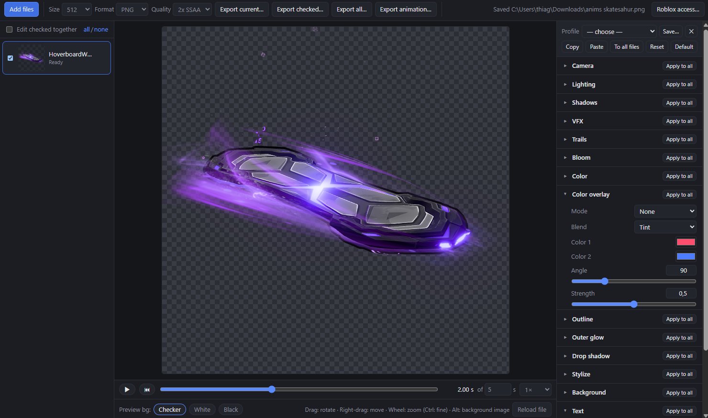
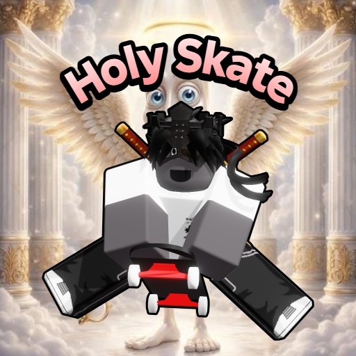
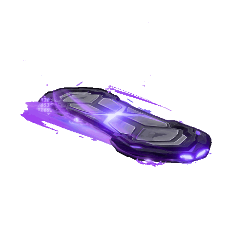
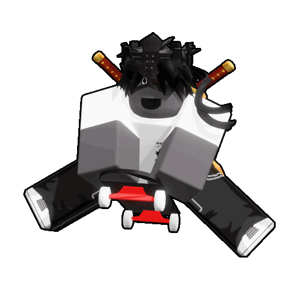

# Roblox Icon Renderer

A Windows app that turns Roblox `.rbxm` / `.rbxmx` models (and `.obj`) into icons, with post-processing effects, Roblox VFX, rig animations and batch export.

## ⬇ Download

**[Download the installer (Windows)](https://github.com/ColderThiago13/Roblox-Icon-Renderer-App/releases/latest/download/Roblox-Icon-Renderer-Setup.exe)** · [All releases](https://github.com/ColderThiago13/Roblox-Icon-Renderer-App/releases)

The link always points to the newest version, so it's the only installer you need. Once installed, the app checks GitHub on launch and shows an **Update** button in the toolbar when a newer version is out: one click downloads it, a second restarts into the new version. Your settings, profiles and Roblox API key are kept.

Installs per user (no admin needed) with Desktop and Start Menu shortcuts. Windows SmartScreen may warn because the installer isn't code-signed: choose *More info → Run anyway*. Uninstall from Windows Settings → Apps.

| Icon with background image and text | Animated GIF export | Rig animation export |
| :---: | :---: | :---: |
|  |  |  |

## Quick start

1. Install the Windows app using the download link above.
2. Drop a `.rbxm`, `.rbxmx` or `.obj` file into the window. Set up **Roblox access…** if its meshes or textures need downloading.
3. Drag to rotate, right-drag to move, and scroll to zoom. Hold **Ctrl** while scrolling for fine zoom adjustments, down to **0.01×**.
4. Adjust the look in the settings panel, then choose **Export current…**. Check multiple files to export a batch.

## Roblox asset access

Files only *reference* meshes and textures (`rbxassetid://…`). Since April 2025, Roblox requires authentication to download them. Open **Roblox access…** in the toolbar and enter one of these:

- **Open Cloud API key** (preferred): Creator Dashboard → API Keys, with the scope `legacy-asset:manage`. Downloads go through `apis.roblox.com/asset-delivery-api/v1/assetId/{id}`.
- **.ROBLOSECURITY cookie** (fallback): used with `assetdelivery.roblox.com/v1/asset/?id=`. It grants full account access, so use an alt account.

Credentials are encrypted with the OS keychain (`safeStorage`) and only sent to roblox.com. Everything (credentials, settings, `asset-cache`) lives in `%APPDATA%\roblox-icon-renderer`, which updates and reinstalls keep. You can also put a file named after the asset ID into the asset cache folder to use it offline.

If an asset can't be downloaded, the app still renders: missing meshes show as their bounding box, and every problem is listed under the preview.

## Features

**Workspace, sessions and tray**
- The **Workspace** panel (under the file list) shows the current file's instance tree with class icons. Select models (Ctrl+click or Shift+click for several) and drag them onto the file list: each becomes its own icon, rendering only that model and starting from the current settings.
- Right-click anything in the Workspace to **Disable** it: it and everything under it leave the render, and its row turns grey with **(Disabled)**. Right-click again to enable it. Models dragged out keep the disabled state of their own children.
- Open files, split-out models and their edits are saved automatically and reopened on the next launch.
- **Discord activity**: while Discord is open, your profile shows Roblox Icon Renderer with the file you're editing.
- **Settings** (gear in the toolbar): theme (Dark, Light, Midnight, Studio), accent color, interface size and launch animation; Discord activity on/off and what it shows (file name, open files, time); reopening files on launch, closing to the tray, automatic update checks; Roblox access and the asset cache.
- **Hide to tray** sends the window to the Windows notification area (hidden icons); click the tray icon to bring it back, or right-click it to quit.

**Model support**
- Binary `.rbxm`: LZ4 and ZSTD chunks, SharedStrings, the new Content type. XML `.rbxmx`. `.obj` (including vertex colors).
- Thin parts and flat meshes (cards, leaves, blades) render from both sides, and zero-thickness parts no longer turn black. MeshParts with `DoubleSided` render both sides too.
- Parts: Block, Ball, Cylinder, Wedge and CornerWedge shapes; WedgePart, CornerWedgePart, MeshPart, SpecialMesh (FileMesh, Brick, Sphere, Cylinder, Head, Wedge), BlockMesh and CylinderMesh.
- FileMesh versions 1.00 to 7.00, including Draco-compressed v7. Only the highest-detail LOD is drawn.
- Materials: color, transparency, reflectance and material type (Neon glows through bloom; Glass, metals, ForceField).
- Textures: `TextureID`, where the part color shows through transparent pixels as in Roblox. SurfaceAppearance (color, normal, roughness and metalness maps; Overlay and Transparency alpha modes). Decals, and Textures with stud tiling.
- Avatar appearance: **BodyColors** on R6/R15 body parts (including legacy BrickColor values), classic **Shirt**, **Pants**, and **ShirtGraphic** T-shirts. Pants draw under shirts on the torso; transparent clothing pixels reveal the body or existing mesh texture. R15 segments share the clothing image across each limb instead of repeating it.
- **Classic R6 bodies** (a Humanoid with block Torso/arms/legs) render like Studio: Roblox's chamfered limb meshes, with body colors, pants, shirt and T-shirt composited into one texture using Roblox's own layout. These files, the classic head mesh and built-in `rbxasset://` files such as the default face are read from your local Roblox Studio or Roblox player install; without one, an equivalent chamfered shape with a box-projected template is used and a warning says so.
- R6 **CharacterMesh** body replacements with base and overlay textures, including the newer Content properties. Accessories and face decals keep their existing textures and follow rig poses.

**VFX**
- **Timeline bar** under the preview: scrub to any moment after the VFX started, or play it back (Space) at 0.25×–2×. Exports use the chosen moment.
- ParticleEmitter: deterministic simulation (same settings → same frame) covering rate, lifetime, speed, spread, acceleration, drag, size/transparency/color sequences with envelopes, Squash, rotation, LightEmission (alpha to additive), Brightness/LightInfluence, ZOffset (keeps on-screen size), all four Orientation modes, emitter shapes, and flipbooks (2×2/4×4/8×8/Custom, OneShot/Loop/PingPong/Random, frame blending; ignored on non power-of-two textures like Roblox).
- Particle counts match Studio at max graphics (full Rate, no quality reduction). **Prewarm** (on by default) starts emitters already running, as they are when you look at them in Studio.
- LightInfluence > 0 effects are lit by **Scene light for lit VFX** (default 2 ≈ Studio daylight); Brightness applies to the unlit part.
- `EmitCount` / `EmitDelay` attributes (a common VFX-pack convention) fire a burst at `EmitDelay` seconds on the timeline.
- Beam: bezier curve, widths, sequences, texture modes and TextureSpeed scrolling. The texture runs top→bottom from Attachment0 to Attachment1; with FaceCamera off the width follows the attachments' Y axes. Fire, Smoke and Sparkles.
- PointLight, SpotLight and SurfaceLight. Highlight (fill plus a 2D outline).

**Trails**
- Trails are **off by default** (Trails → Show trails). A separate **Trails** section controls visibility, **Length / motion cap (studs)**, lighting, framing, and inclusion in outlines/glow. **Show VFX** and **Show trails** work independently. Set length to zero to hide trails.
- **Auto** uses the selected rig animation's recent attachment motion, sampled at the chosen animation time. With no animation selected, it previews a straight trail sweeping behind the object (behind the HumanoidRootPart for characters, otherwise away from the model's center), always across the attachment edge so the ribbon shows its full width. **Direction** uses a straight trail along **Direction path: yaw/tilt** instead; **Animation** only shows actual animation motion.
- Supports the file's Enabled, Lifetime, MinLength, MaxLength, WidthScale, Color, Transparency, FaceCamera, texture tiling/stretching, Brightness, LightEmission, and LightInfluence. The user length caps motion paths; the file's MaxLength can shorten them further. Previews, thumbnails, and exports use the same path. No past motion is shown at animation time zero.

**Animations (rigs)**
- Files with Motor6D/AnimationConstraint joints or Bones show an **Animation bar**: pick any KeyframeSequence found in the file (or an Animation instance, downloaded on demand), or paste an animation ID/URL and press **Add**. With **Edit checked together** on, the ID is added to every checked rig.
- Scrub or play the animation; welded parts, accessories, VFX and Highlights follow the pose. Exports use the chosen pose.
- Skinned meshes (MeshParts deformed by `Bone` instances) bend with the bones, using the skin weights stored in the mesh.
- Keyframe easing follows Roblox's PoseEasingStyle/Direction. Animations made with the curve editor (CurveAnimation) aren't supported yet.
- Attachments placed directly in a Model are positioned from the Model's pivot, like Roblox.

**Rendering and post-processing**
- Camera: auto-fit framing, rotation, tilt, roll, zoom, offset, perspective or orthographic.
- Lighting: tone mapping (Neutral, ACES, AgX), key/fill/rim lights, ambient, environment reflections, self shadows, ground shadow.
- Bloom with threshold, strength and radius. Brightness, contrast, saturation, hue, gamma, temperature.
- Color overlay: solid, gradient or rainbow, with normal, multiply, screen, overlay or tint blending.
- Silhouette effects from a GPU distance field: outline, outer glow, drop shadow.
- Stylize: sharpen, chromatic aberration, posterize, grain, vignette, and pixelate (level N = (N+1)-px blocks at 512, applied last so outline/glow/shadow are pixelated too; 0 = off).
- Background: transparent, solid, linear/radial gradient, or **an image** (Choose… in the Background section, or drop an image on the preview). Fit (cover, contain, stretch, tile), scale, offset and rotation; Alt+drag moves it and Alt+wheel scales it on the preview. The image is stored with the settings, so profiles and copied settings carry it.

**Text**
- **Double-click a text on the preview to type right on it** (Enter or clicking away finishes, Shift+Enter adds a line). Side handles stretch the width or height alone; corner handles scale the whole text.
- Any number of text layers per file (**Text** section → **+ Add text**), drawn over the model and background in preview, thumbnails and every export.
- Fonts: Roblox Studio's own font families (Builder Sans, Luckiest Guy, Fredoka One, Bangers, Montserrat, Oswald, Press Start 2P, Creepster and more, read from your local Roblox install, with their real weights), then common Windows fonts.
- Size, weight, italic, alignment, letter spacing, line height, opacity; fill and stroke each in **solid, gradient (any angle), radial or rainbow** color modes, stroke (width and color), drop shadow (blur, offset, color), rotation, and **curve** (bend the text along an arc, up or down; multi-line text curves around a shared center).
- On the preview: drag a text to move it, corner handles resize (stroke scales with it), the top handle rotates (Shift snaps to 15°), the wheel over a text resizes it, double-click edits the text, Delete removes, arrow keys nudge. Layers can be reordered, and **Apply to all** copies them to every file; with *Edit checked together*, edits reach the same layer in the checked files.
- Pixel values are defined at 512 px and scale with the export size, so an icon looks the same at 256 px and at 4096 px.

**Batch workflow**
- Drop many files. Each one has its own settings and thumbnail.
- **Edit checked together** applies every change to all checked files.
- **Profiles** (top of the settings panel): save the current settings under a name and apply them to any file later. Profiles live in `%APPDATA%\roblox-icon-renderer\profiles.json`, so updates keep them.
- Per-section **Apply to all**, Copy/Paste, **To all files**, and **Default** (settings new files start with).
- Export the current file, the checked files or all files as PNG, WebP or JPEG at 256 to 4096 px, with optional 2× supersampling.
- **Export animation…** renders a clip at exact frame times as a PNG sequence, a PNG sprite sheet with JSON frame data, or a GIF. Choose the frame size (64–4096 px), which clock advances (animation, VFX or both), start, duration, FPS and looping; sprite sheets can instead be sized as a **whole sheet** (1024–16384 px) so FPS and duration only change how small each frame is; the dialog shows the grid, frame size and sheet size as you edit; framing is locked across the clip by default. Works for the current, checked or all files, with progress and Cancel. GIFs use one shared palette, 1-bit transparency or a solid background, and are capped at 1024 px.

## Known limitations

- Unions (CSG) render as their bounding box. Their geometry lives in a separate obfuscated asset.
- Classic clothing maps exactly on classic R6 bodies (with Roblox installed) and block bodies; rounded R15 and custom meshes use a box projection, so seams and curved surfaces may differ from Studio. Custom avatar UV layouts are not reproduced.
- Layered clothing (WrapLayer/WrapTarget cage deformation), dynamic facial animation, and CurveAnimation are not supported. Layered accessories render their saved mesh shape, with a warning. HumanoidDescription assets must be applied in Studio before saving the model; this app renders the instances present in the file.
- Trails use at most 128 motion segments over the file's Lifetime (up to 20 seconds); history resets at the beginning of animation playback. Script-driven world movement isn't stored in model files. Wrap and Static texture modes currently share the same attachment-relative tiling.
- Material textures (wood grain, brick, …) are not reproduced; parts use flat color with per-material roughness and metalness.
- Built-in `rbxasset://` particle textures are replaced with procedural look-alikes.
- Highlight `DepthMode = Occluded` is drawn as AlwaysOnTop.

## References

- Binary model format: https://dom.rojo.space/binary.html
- FileMesh format: https://devforum.roblox.com/t/roblox-filemesh-format-specification/326114
- Asset Delivery API: https://create.roblox.com/docs/cloud/reference/domains/assetdelivery
- Test models: https://github.com/rojo-rbx/rbx-test-files
