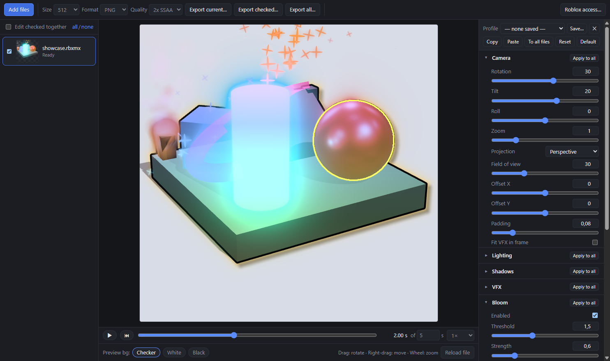

# Roblox Icon Renderer

A Windows app that turns Roblox `.rbxm` / `.rbxmx` models (and `.obj`) into icons, with post-processing effects, Roblox VFX, rig animations and batch export.

## ⬇ Download

**[Download the installer (Windows)](https://github.com/ColderThiago13/Roblox-Icon-Renderer-App/releases/latest/download/Roblox-Icon-Renderer-Setup.exe)** · [All releases](https://github.com/ColderThiago13/Roblox-Icon-Renderer-App/releases)

The link always points to the newest version, so it's the only installer you need. Once installed, the app checks GitHub on launch and shows an **Update** button in the toolbar when a newer version is out: one click downloads it, a second restarts into the new version. Your settings, profiles and Roblox API key are kept.

Installs per user (no admin needed) with Desktop and Start Menu shortcuts. Windows SmartScreen may warn because the installer isn't code-signed: choose *More info → Run anyway*. Uninstall from Windows Settings → Apps.



## Run from source

```sh
npm install
npm start          # launch the app
npm test           # parser tests (pass a rbx-test-files checkout for the full cross-check)
npm run pack       # unpacked build in dist/win-unpacked
npm run dist       # Windows installer in dist/
```

> If `npm start` fails with `does not provide an export named 'BrowserWindow'`, your shell has `ELECTRON_RUN_AS_NODE=1` set (some editor terminals do this). Unset it and try again.

## Roblox asset access

Files only *reference* meshes and textures (`rbxassetid://…`). Since April 2025, Roblox requires authentication to download them. Open **Roblox access…** in the toolbar and enter one of these:

- **Open Cloud API key** (preferred): Creator Dashboard → API Keys, with the scope `legacy-asset:manage`. Downloads go through `apis.roblox.com/asset-delivery-api/v1/assetId/{id}`.
- **.ROBLOSECURITY cookie** (fallback): used with `assetdelivery.roblox.com/v1/asset/?id=`. It grants full account access, so use an alt account.

Credentials are encrypted with the OS keychain (`safeStorage`) and only sent to roblox.com. Everything (credentials, settings, `asset-cache`) lives in `%APPDATA%
oblox-icon-renderer`, which updates and reinstalls keep. You can also put a file named after the asset ID into that folder to use it offline.

If an asset can't be downloaded, the app still renders: missing meshes show as their bounding box, and every problem is listed under the preview.

## Features

**Model support**
- Binary `.rbxm`: LZ4 and ZSTD chunks, SharedStrings, the new Content type. XML `.rbxmx`. `.obj` (including vertex colors).
- Parts: Block, Ball, Cylinder, Wedge and CornerWedge shapes; WedgePart, CornerWedgePart, MeshPart, SpecialMesh (FileMesh, Brick, Sphere, Cylinder, Head, Wedge), BlockMesh and CylinderMesh.
- FileMesh versions 1.00 to 7.00, including Draco-compressed v7. Only the highest-detail LOD is drawn.
- Materials: color, transparency, reflectance and material type (Neon glows through bloom; Glass, metals, ForceField).
- Textures: `TextureID`, where the part color shows through transparent pixels as in Roblox. SurfaceAppearance (color, normal, roughness and metalness maps; Overlay and Transparency alpha modes). Decals, and Textures with stud tiling.

**VFX**
- **Timeline bar** under the preview: scrub to any moment after the VFX started, or play it back (Space) at 0.25×–2×. Exports use the chosen moment.
- ParticleEmitter: deterministic simulation (same settings → same frame) covering rate, lifetime, speed, spread, acceleration, drag, size/transparency/color sequences with envelopes, Squash, rotation, LightEmission (alpha to additive), Brightness/LightInfluence, ZOffset (keeps on-screen size), all four Orientation modes, emitter shapes, and flipbooks (2×2/4×4/8×8/Custom, OneShot/Loop/PingPong/Random, frame blending; ignored on non power-of-two textures like Roblox).
- Particle counts match Studio at max graphics (full Rate, no quality reduction). **Prewarm** (on by default) starts emitters already running, as they are when you look at them in Studio.
- LightInfluence > 0 effects are lit by **Scene light for lit VFX** (default 2 ≈ Studio daylight); Brightness applies to the unlit part.
- `EmitCount` / `EmitDelay` attributes (a common VFX-pack convention) fire a burst at `EmitDelay` seconds on the timeline.
- Beam: bezier curve, widths, sequences, texture modes and TextureSpeed scrolling. The texture runs top→bottom from Attachment0 to Attachment1; with FaceCamera off the width follows the attachments' Y axes. Fire, Smoke and Sparkles.
- PointLight, SpotLight and SurfaceLight. Highlight (fill plus a 2D outline).

**Animations (rigs)**
- Files with Motor6D/AnimationConstraint joints or Bones show an **Animation bar**: pick any KeyframeSequence found in the file (or an Animation instance, downloaded on demand), or paste an animation ID/URL and press **Add**. With **Edit checked together** on, the ID is added to every checked rig.
- Scrub or play the animation; welded parts, accessories, VFX and Highlights follow the pose. Exports use the chosen pose.
- Skinned meshes (MeshParts deformed by `Bone` instances) bend with the bones, using the skin weights stored in the mesh.
- Keyframe easing follows Roblox's PoseEasingStyle/Direction. Animations made with the curve editor (CurveAnimation) aren't supported yet.
- Attachments placed directly in a Model are positioned from the Model's pivot, like Roblox.

**Rendering and post-processing**
- Camera: auto-fit framing, rotation, tilt, roll, zoom, offset, perspective or orthographic.
- Lighting: tone mapping (Neutral, ACES, AgX), key/fill/rim lights, ambient, environment reflections, self shadows, ground shadow.
- Bloom with threshold, strength and radius. Brightness, contrast, saturation, hue, gamma, temperature.
- Color overlay: solid, gradient or rainbow, with normal, multiply, screen, overlay or tint blending.
- Silhouette effects from a GPU distance field: outline, outer glow, drop shadow.
- Stylize: sharpen, chromatic aberration, posterize, grain, vignette, and pixelate (level N = (N+1)-px blocks at 512, applied last so outline/glow/shadow are pixelated too; 0 = off).
- Background: transparent, solid, or linear/radial gradient.
- Pixel values are defined at 512 px and scale with the export size, so an icon looks the same at 256 px and at 4096 px.

**Batch workflow**
- Drop many files. Each one has its own settings and thumbnail.
- **Edit checked together** applies every change to all checked files.
- **Profiles** (top of the settings panel): save the current settings under a name and apply them to any file later. Profiles live in `%APPDATA%\roblox-icon-renderer\profiles.json`, so updates keep them.
- Per-section **Apply to all**, Copy/Paste, **To all files**, and **Default** (settings new files start with).
- Export the current file, the checked files or all files as PNG, WebP or JPEG at 256 to 4096 px, with optional 2× supersampling.

## Known limitations

- Unions (CSG) render as their bounding box. Their geometry lives in a separate obfuscated asset.
- Trails are skipped because they need motion. Clothing (Shirt/Pants) and BodyColors are not applied.
- Material textures (wood grain, brick, …) are not reproduced; parts use flat color with per-material roughness and metalness.
- Built-in `rbxasset://` particle textures are replaced with procedural look-alikes.
- Highlight `DepthMode = Occluded` is drawn as AlwaysOnTop.

## Releasing a new version

1. Bump `version` in `package.json` (e.g. `0.5.0` → `0.5.1`).
2. Run `npm run release` with a GitHub token that can write to the repo in `GH_TOKEN`. It builds the installer and publishes a GitHub release with `Roblox-Icon-Renderer-Setup.exe`, its `.blockmap` and `latest.yml`.
3. Installed apps see the release on their next launch and offer the update (only the changed blocks are downloaded).

## Layout

```
main.js / preload.cjs     Electron shell: app:// protocol, asset download and cache, dialogs
src/rbx/                  binary.js, xml.js (model parsers), mesh.js (FileMesh), instance.js
src/scene/                build.js (instances → three.js), vfx.js, assets.js, job.js
src/render/               renderer.js (multi-pass pipeline), shaders.js
src/ui/                   app.js, style.css
src/settings.js           settings schema (drives both the UI panel and the defaults)
```

## References

- Binary model format: https://dom.rojo.space/binary.html
- FileMesh format: https://devforum.roblox.com/t/roblox-filemesh-format-specification/326114
- Asset Delivery API: https://create.roblox.com/docs/cloud/reference/domains/assetdelivery
- Test models: https://github.com/rojo-rbx/rbx-test-files
